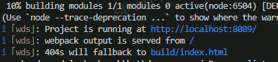

---
title: Vs Code 
date: 2022-05-16 15:28:32
tags: vscode
--- 

### Debug `React`&`Vue` 
- npm start  
      
  编译成功后设置断点

- 点击调试按钮
- 自动停在断点处
- 添加`launch.json`  
  ```js
  //跳过源码或者不用添加下面命令直接点击 F5
  "skipFiles": [
    "<node_internals>/**"
  ]  
  ```

 

https://code.visualstudio.com/docs/nodejs/
