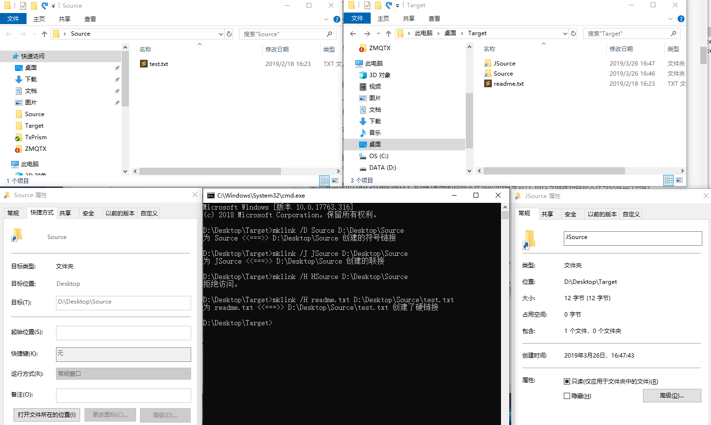

### mklink /D和/J的区别

1. /D 指向Source 目录 保存目录路径不占用目录空间
1. /J 指向Source 目录 保存目录路径占用目录空间
1. /H 硬链接只能用于文件，不能用于文件夹



``` bash
D:\Desktop\Target>mklink /D Source D:\Desktop\Source
为 Source <<===>> D:\Desktop\Source 创建的符号链接

D:\Desktop\Target>mklink /J JSource D:\Desktop\Source
为 JSource <<===>> D:\Desktop\Source 创建的联接

D:\Desktop\Target>mklink /H readme.txt D:\Desktop\Source\test.txt
为 readme.txt <<===>> D:\Desktop\Source\test.txt 创建了硬链接
```
