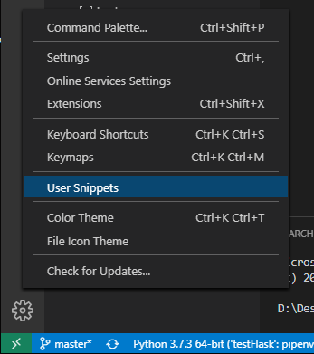
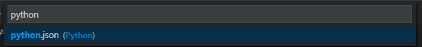

``` bash
{
  "HEADER": {
    "prefix": "header",
    "body": [
      "#!/usr/bin/env python",
      "# -*- coding: utf-8 -*-",
      "",
      "#Time: $CURRENT_YEAR-$CURRENT_MONTH-$CURRENT_DATE $CURRENT_HOUR:$CURRENT_MINUTE:$CURRENT_SECOND",
      "#Author: androllen",
      "#Contact: androllen#hotmail.com",
      "",
      "$0"
    ],
    "description": "header Comment"
  }
}
```

