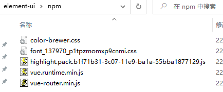
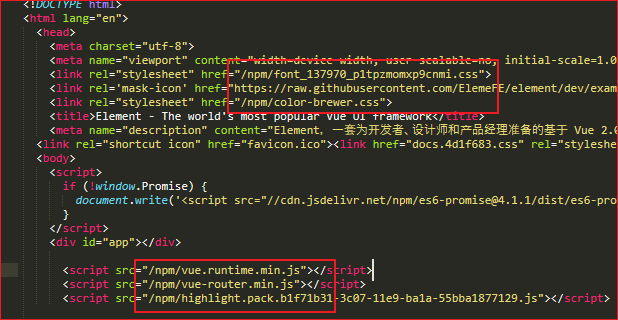

### 下载 

[https://github.com/ElemeFE/element/releases/tag/v2.15.6](https://github.com/ElemeFE/element/releases/tag/v2.15.6)

### 准备

npm install http-server -g

需要提前下载下面五个文件  

  

更改npm文件夹路径下的文件  

  

### 生成

```sh
nvm list
nvm use 14.18.2
npm install
npm run dev
npm run deploy:build
```

### 部署

```sh
# cd 到 examples\element-ui 目录下
http-server -p 8080
http://127.0.0.1:8080
```

