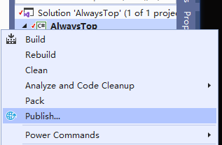
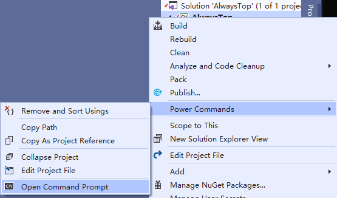

### Visual Studio GUI发布  
  
    
  

### Visual Studio 命令行发布  
  
    

  ``` bash
  # PublishSingleFile  - 单文件
  # PublishTrimmed     - 分析 IL 并剪裁未使用的程序集来减小应用的大小
  dotnet publish -r win-x86 -c Release /p:PublishSingleFile=true /p:PublishTrimmed=true
  ```

### 命令行工具

```sh
# x64 Native Tools Command Prompt for VS 2019
D:\Microsoft\Microsoft Visual Studio\2019\Professional>cd D:\Git Down\AlwaysTop\AlwaysTop

D:\Git Down\AlwaysTop\AlwaysTop>dotnet publish -r win-x86 -c Release /p:PublishSingleFile=true /p:PublishTrimmed=true

欢迎使用 .NET Core 3.1!
---------------------
SDK 版本: 3.1.300

遥测
---------
.NET Core 工具收集使用数据，以帮助我们改善你的体验。数据是匿名的。它由 Microsoft 收集并与社区共享。你可以通过使用喜欢的 shell 将 DOTNET_CLI_TELEMETRY_OPTOUT 环境变量设置为 "1" 或 "true" 来选择退出遥测。

阅读有关 .NET Core CLI 工具遥测的更多信息: https://aka.ms/dotnet-cli-telemetry

----------------
查看文档: https://aka.ms/dotnet-docs
通过 GitHub 报告问题和查找源: https://github.com/dotnet/core
查找最新功能: https://aka.ms/dotnet-whats-new
了解已安装的 HTTPS 开发者证书: https://aka.ms/aspnet-core-https
使用 "dotnet --help" 查看可用命令或访问: https://aka.ms/dotnet-cli-docs
编写你的第一个应用: https://aka.ms/first-net-core-app
--------------------------------------------------------------------------------------
用于 .NET Core 的 Microsoft (R) 生成引擎版本 16.6.0+5ff7b0c9e
版权所有(C) Microsoft Corporation。保留所有权利。

正在确定要还原的项目…
已还原 D:\Git Down\AlwaysTop\AlwaysTop\AlwaysTop.csproj (用时 9.36 sec)。
AlwaysTop -> D:\Git Down\AlwaysTop\AlwaysTop\bin\Release\netcoreapp3.1\win-x86\AlwaysTop.dll
正在优化程序集的大小，这可能更改应用的行为。请务必在发布后进行测试。请参阅: https://aka.ms/dotnet-illink
AlwaysTop -> D:\Git Down\AlwaysTop\AlwaysTop\bin\Release\netcoreapp3.1\win-x86\publish\
```
