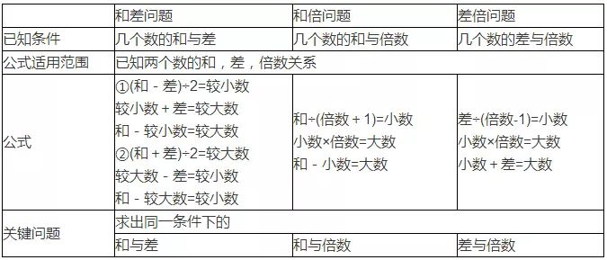
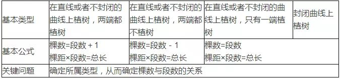

<h3 style=" text-align:center;">学好小学数学，这3点必须牢记</h3>

1. 抓住课堂。  
    `平日学习最重要的是课堂45分钟，听讲要聚精会神，思维紧跟老师。对于老师给出的规律. 定理，不仅要知“其然”还要“知其所以然”。`
2. 重视计算。  
    `数学的计算学习就像语文的识字学习，是最基本的。不识字，语文读不好；计算差，数学同样学不好。而且计算好，会给孩子数学学习提供很大的帮助。`
3. 归类整理，形成知识网络体系。  
    `对所学的知识要进行系统整理，融会贯通，理清知识的来龙去脉. 前因后果。再进行归类整理，理清每一个单元的重点是什么！`

<h3 style=" text-align:center;">34个小学数学必考公式</h3>

1. 和差倍问题  
    

2. 年龄问题的三个基本特征  

   ①两个人的年龄差是不变的；  
   ②两个人的年龄是同时增加或者同时减少的；  
   ③两个人的年龄的倍数是发生变化的；  

3. 归一问题的基本特点

    问题中有一个不变的量，一般是那个“单一量”，题目一般用“照这样的速度”……等词语来表示。

    关键问题：

    根据题目中的条件确定并求出单一量；

4. 植树问题：  
    

5. 鸡兔同笼问题：

    基本概念：

    鸡兔同笼问题又称为置换问题. 假设问题，就是把假设错的那部分置换出来；

    基本思路：

    ①假设，即假设某种现象存在（甲和乙一样或者乙和甲一样）：

    ②假设后，发生了和题目条件不同的差，找出这个差是多少；

    ③每个事物造成的差是固定的，从而找出出现这个差的原因；

    ④再根据这两个差作适当的调整，消去出现的差。

    基本公式：

    ①把所有鸡假设成兔子：鸡数＝（兔脚数×总头数－总脚数）÷（兔脚数－鸡脚数）

    ②把所有兔子假设成鸡：兔数＝（总脚数一鸡脚数×总头数）÷（兔脚数一鸡脚数）

    关键问题：找出总量的差与单位量的差。

6. 盈亏问题：

    基本概念：

    一定量的对象，按照某种标准分组，产生一种结果：按照另一种标准分组，又产生一种结果，由于分组的标准不同，造成结果的差异，由它们的关系求对象分组的组数或对象的总量。

    基本思路：

    先将两种分配方案进行比较，分析由于标准的差异造成结果的变化，根据这个关系求出参加分配的总份数，然后根据题意求出对象的总量。

    基本题型：

    ①一次有余数，另一次不足；

    基本公式：总份数＝（余数＋不足数）÷两次每份数的差

    ②当两次都有余数；

    基本公式：总份数＝（较大余数一较小余数）÷两次每份数的差

    ③当两次都不足；

    基本公式：总份数＝（较大不足数一较小不足数）÷两次每份数的差

    基本特点：

    对象总量和总的组数是不变的。

    关键问题：

    确定对象总量和总的组数。

7. 牛吃草问题：

    基本思路：

    假设每头牛吃草的速度为“1”份，根据两次不同的吃法，求出其中的总草量的差；再找出造成这种差异的原因，即可确定草的生长速度和总草量。

    基本特点：

    原草量和新草生长速度是不变的；

    关键问题：

    确定两个不变的量。

    基本公式：

    生长量=（较长时间×长时间牛头数-较短时间×短时间牛头数）÷（长时间-短时间）；

    总草量=较长时间×长时间牛头数-较长时间×生长量；

8. 周期循环与数表规律：

    周期现象：

    事物在运动变化的过程中，某些特征有规律循环出现。

    周期：

    我们把连续两次出现所经过的时间叫周期。

    关键问题：

    确定循环周期。

    闰 年：一年有366天；

    ①年份能被4整除；②如果年份能被100整除，则年份必须能被400整除；

    平 年：一年有365天。

    ①年份不能被4整除；②如果年份能被100整除，但不能被400整除；

9. 平均数：

    基本公式：

    ①平均数=总数量÷总份数

    总数量=平均数×总份数

    总份数=总数量÷平均数

    ②平均数=基准数＋每一个数与基准数差的和÷总份数

    基本算法：

    ①求出总数量以及总份数，利用基本公式①进行计算.

    ②基准数法：根据给出的数之间的关系，确定一个基准数；一般选与所有数比较接近的数或者中间数为基准数；以基准数为标准，求所有给出数与基准数的差；再求出所有差的和；再求出这些差的平均数；最后求这个差的平均数和基准数的和，就是所求的平均数，具体关系见基本公式②

10. 抽屉原理：

    抽屉原则一：

    如果把（n+1）个物体放在n个抽屉里，那么必有一个抽屉中至少放有2个物体。

    例：把4个物体放在3个抽屉里，也就是把4分解成三个整数的和，那么就有以下四种情况：

    ①4=4+0+0 ②4=3+1+0 ③4=2+2+0 ④4=2+1+1

    观察上面四种放物体的方式，我们会发现一个共同特点：总有那么一个抽屉里有2个或多于2个物体，也就是说必有一个抽屉中至少放有2个物体。

    抽屉原则二：

    如果把n个物体放在m个抽屉里，其中n>m，那么必有一个抽屉至少有:

    ①k=[n/m ]+1个物体：当n不能被m整除时。

    ②k=n/m个物体：当n能被m整除时。

    理解知识点：

    [X]表示不超过X的最大整数。

    例[4.351]=4；[0.321]=0；[2.9999]=2；

    关键问题：

    构造物体和抽屉。也就是找到代表物体和抽屉的量，而后依据抽屉原则进行运算。

11. 定义新运算：

    基本概念：

    定义一种新的运算符号，这个新的运算符号包含有多种基本（混合）运算。

    基本思路：

    严格按照新定义的运算规则，把已知的数代入，转化为加减乘除的运算，然后按照基本运算过程. 规律进行运算。

    关键问题：

    正确理解定义的运算符号的意义。

    注意事项：

    ①新的运算不一定符合运算规律，特别注意运算顺序。

    ②每个新定义的运算符号只能在本题中使用。

12. 数列求和：

    等差数列：

    在一列数中，任意相邻两个数的差是一定的，这样的一列数，就叫做等差数列。

    基本概念：

    首项：等差数列的第一个数，一般用a1表示；

    项数：等差数列的所有数的个数，一般用n表示；

    公差：数列中任意相邻两个数的差，一般用d表示；

    通项：表示数列中每一个数的公式，一般用an表示；

    数列的和：这一数列全部数字的和，一般用Sn表示．

    基本思路：

    等差数列中涉及五个量：a1 ,an, d, n,sn,,通项公式中涉及四个量，如果己知其中三个，就可求出第四个；求和公式中涉及四个量，如果己知其中三个，就可以求这第四个。

    基本公式：

    通项公式：an = a1+（n－1）d；

    通项＝首项＋（项数一1)×公差；

    数列和公式：sn,= (a1+ an)×n÷2；

    数列和＝（首项＋末项）×项数÷2；

    项数公式：n= (an+ a1)÷d＋1；

    项数=（末项-首项）÷公差＋1；

    公差公式：d =（an－a1））÷（n－1）；

    公差=（末项－首项）÷（项数－1）；

    关键问题：

    确定已知量和未知量，确定使用的公式；

13. 二进制及其应用：

    十进制：

    用0～9十个数字表示，逢10进1；不同数位上的数字表示不同的含义，十位上的2表示20，百位上的2表示200。所以234=200+30+4=2×102+3×10+4。

    =An×10n-1+An-1×10n-2+An-2×10n-3+An-3×10n-4+An-4×10n-5+An-6×10n-7+……+A3×102+A2×101+A1×100

    注意：N0=１；N１=N（其中N是任意自然数）

    二进制：

    用0～1两个数字表示，逢2进1；不同数位上的数字表示不同的含义。

    (2)= An×2n-1+An-1×2n-2+An-2×2n-3+An-3×2n-4+An-4×2n-5+An-6×2n-7

    +……+A3×22+A2×21+A1×20

    注意：An不是0就是1。

    十进制化成二进制：

    ①根据二进制满2进1的特点，用2连续去除这个数，直到商为0，然后把每次所得的余数按自下而上依次写出即可。

    ②先找出不大于该数的2的n次方，再求它们的差，再找不大于这个差的2的n次方，依此方法一直找到差为0，按照二进制展开式特点即可写出。

14. 加法乘法原理和几何计数：

    加法原理：

    如果完成一件任务有n类方法，在第一类方法中有m1种不同方法，在第二类方法中有m2种不同方法……，在第n类方法中有mn种不同方法，那么完成这件任务共有：m1+ m2....... +mn种不同的方法。

    关键问题：

    确定工作的分类方法。

    基本特征：

    每一种方法都可完成任务。

    乘法原理：

    如果完成一件任务需要分成n个步骤进行，做第1步有m1种方法，不管第1步用哪一种方法，第2步总有m2种方法……不管前面n-1步用哪种方法，第n步总有mn种方法，那么完成这件任务共有：m1×m2.......×mn种不同的方法。

    关键问题：

    确定工作的完成步骤。

    基本特征：

    每一步只能完成任务的一部分。

    直线：

    一点在直线或空间沿一定方向或相反方向运动，形成的轨迹。

    直线特点：

    没有端点，没有长度。

    线段：

    直线上任意两点间的距离。这两点叫端点。

    线段特点：

    有两个端点，有长度。

    射线：

    把直线的一端无限延长。

    射线特点：

    只有一个端点；没有长度。

    ①数线段规律：总数＝1+2+3+…+（点数一1）；

    ②数角规律=1+2+3+…+（射线数一1）；

    ③数长方形规律：个数=长的线段数×宽的线段数：

    ④数长方形规律：个数=1×1+2×2+3×3+…+行数×列数

15. 质数与合数：

    质数：

    一个数除了1和它本身之外，没有别的约数，这个数叫做质数，也叫做素数。

    合数：

    一个数除了1和它本身之外，还有别的约数，这个数叫做合数。

    质因数：

    如果某个质数是某个数的约数，那么这个质数叫做这个数的质因数。

    分解质因数：

    把一个数用质数相乘的形式表示出来，叫做分解质因数。通常用短除法分解质因数。任何一个合数分解质因数的结果是的。

    分解质因数的标准表示形式：

    N= ，其中a1. a2. a3……an都是合数N的质因数，且a1<a2<a3<……<an。

    求约数个数的公式：

    P=(r1+1)×(r2+1)×(r3+1)×……×(rn+1)

    互质数：

    如果两个数的最大公约数是1，这两个数叫做互质数。

16. 约数与倍数：

    约数和倍数：

    若整数a能够被b整除，a叫做b的倍数，b就叫做a的约数。

    公约数：

    几个数公有的约数，叫做这几个数的公约数；其中最大的一个，叫做这几个数的最大公约数。

    最大公约数的性质：

    1. 几个数都除以它们的最大公约数，所得的几个商是互质数。

    2. 几个数的最大公约数都是这几个数的约数。

    3. 几个数的公约数，都是这几个数的最大公约数的约数。

    4. 几个数都乘以一个自然数m，所得的积的最大公约数等于这几个数的最大公约数乘以m。

    例如：12的约数有1. 2. 3. 4. 6. 12；

    18的约数有：1. 2. 3. 6. 9. 18；

    那么12和18的公约数有：1. 2. 3. 6；

    那么12和18最大的公约数是：6，记作（12，18）=6；

    求最大公约数基本方法：

    5. 分解质因数法：先分解质因数，然后把相同的因数连乘起来。

    6. 短除法：先找公有的约数，然后相乘。

    7. 辗转相除法：每一次都用除数和余数相除，能够整除的那个余数，就是所求的最大公约数。

    公倍数：

    几个数公有的倍数，叫做这几个数的公倍数；其中最小的一个，叫做这几个数的最小公倍数。

    12的倍数有：12. 24. 36. 48……；

    18的倍数有：18. 36. 54. 72……；

    那么12和18的公倍数有：36. 72. 108……；

    那么12和18最小的公倍数是36，记作[12，18]=36；

    最小公倍数的性质：

    8. 两个数的任意公倍数都是它们最小公倍数的倍数。

    9. 两个数最大公约数与最小公倍数的乘积等于这两个数的乘积。

    求最小公倍数基本方法：1. 短除法求最小公倍数；2. 分解质因数的方法

17. 数的整除：

    基本概念和符号：

    1. 整除：如果一个整数a，除以一个自然数b，得到一个整数商c，而且没有余数，那么叫做a能被b整除或b能整除a，记作b|a。

    2. 常用符号：整除符号“|”，不能整除符号“ ”；因为符号“∵”，所以的符号“∴”；

    整除判断方法：

    1.能被2. 5整除：末位上的数字能被2. 5整除。

    2.能被4. 25整除：末两位的数字所组成的数能被4. 25整除。

    3.能被8. 125整除：末三位的数字所组成的数能被8. 125整除。

    4.能被3. 9整除：各个数位上数字的和能被3. 9整除。

    5.能被7整除：

    ①末三位上数字所组成的数与末三位以前的数字所组成数之差能被7整除。

    ②逐次去掉最后一位数字并减去末位数字的2倍后能被7整除。

    6.能被11整除：

    ①末三位上数字所组成的数与末三位以前的数字所组成的数之差能被11整除。

    ②奇数位上的数字和与偶数位数的数字和的差能被11整除。

    ③逐次去掉最后一位数字并减去末位数字后能被11整除。

    7.能被13整除：

    ①末三位上数字所组成的数与末三位以前的数字所组成的数之差能被13整除。

    ②逐次去掉最后一位数字并减去末位数字的9倍后能被13整除。

    整除的性质：

    1.如果a. b能被c整除，那么（a+b）与（a-b）也能被c整除。

    2.如果a能被b整除，c是整数，那么a乘以c也能被b整除。

    3.如果a能被b整除，b又能被c整除，那么a也能被c整除。

    4.如果a能被b. c整除，那么a也能被b和c的最小公倍数整除。

18. 余数及其应用：

    基本概念：

    对任意自然数a. b. q. r，如果使得a÷b=q……r，且0<r<b,那么r叫做a除以b的余数，q叫做a除以b的不完全商。

    余数的性质：

    ①余数小于除数。

    ②若a. b除以c的余数相同，则c|a-b或c|b-a。

    ③a与b的和除以c的余数等于a除以c的余数加上b除以c的余数的和除以c的余数。

    ④a与b的积除以c的余数等于a除以c的余数与b除以c的余数的积除以c的余数。

19. 余数. 同余与周期：

    同余的定义：

    ①若两个整数a. b除以m的余数相同，则称a. b对于模m同余。

    ②已知三个整数a. b. m，如果m|a-b，就称a. b对于模m同余，记作a≡b(mod m)，读作a同余于b模m。

    同余的性质：

    ①自身性：a≡a(mod m)；

    ②对称性：若a≡b(mod m)，则b≡a(mod m)；

    ③传递性：若a≡b(mod m)，b≡c(mod m)，则a≡ c(mod m)；

    ④和差性：若a≡b(mod m)，c≡d(mod m)，则a+c≡b+d(mod m)，a-c≡b-d(mod m)；

    ⑤相乘性：若a≡ b(mod m)，c≡d(mod m)，则a×c≡ b×d(mod m)；

    ⑥乘方性：若a≡b(mod m)，则an≡bn(mod m)；

    ⑦同倍性:若a≡ b(mod m)，整数c，则a×c≡ b×c(mod m×c)；

    关于乘方的预备知识：

    ①若A=a×b，则MA=Ma×b=（Ma）b

    ②若B=c+d则MB=Mc+d=Mc×Md

    被3. 9. 11除后的余数特征：

    ①一个自然数M，n表示M的各个数位上数字的和，则M≡n(mod 9)或（mod 3）；

    ②一个自然数M，X表示M的各个奇数位上数字的和，Y表示M的各个偶数数位上数字的和，则M≡Y-X或M≡11-（X-Y）(mod 11)；

    费尔马小定理：

    如果p是质数（素数），a是自然数，且a不能被p整除，则ap-1≡1(mod p)。

20. 分数与百分数的应用：

    基本概念与性质：

    分数：把单位“1”平均分成几份，表示这样的一份或几份的数。

    分数的性质：分数的分子和分母同时乘以或除以相同的数（0除外），分数的大小不变。

    分数单位：把单位“1”平均分成几份，表示这样一份的数。

    百分数：表示一个数是另一个数百分之几的数。

    常用方法：

    ①逆向思维方法：从题目提供条件的反方向（或结果）进行思考。

    ②对应思维方法：找出题目中具体的量与它所占的率的直接对应关系。

    ③转化思维方法：把一类应用题转化成另一类应用题进行解答。最常见的是转换成比例和转换成倍数关系；把不同的标准（在分数中一般指的是一倍量）下的分率转化成同一条件下的分率。常见的处理方法是确定不同的标准为一倍量。

    ④假设思维方法：为了解题的方便，可以把题目中不相等的量假设成相等或者假设某种情况成立，计算出相应的结果，然后再进行调整，求出最后结果。

    ⑤量不变思维方法：在变化的各个量当中，总有一个量是不变的，不论其他量如何变化，而这个量是始终固定不变的。有以下三种情况：A. 分量发生变化，总量不变。B. 总量发生变化，但其中有的分量不变。C. 总量和分量都发生变化，但分量之间的差量不变化。

    ⑥替换思维方法：用一种量代替另一种量，从而使数量关系单一化. 量率关系明朗化。

    ⑦同倍率法：总量和分量之间按照同分率变化的规律进行处理。

    ⑧浓度配比法：一般应用于总量和分量都发生变化的状况。

21. 分数大小的比较：

    基本方法：

    ①通分分子法：使所有分数的分子相同，根据同分子分数大小和分母的关系比较。

    ②通分分母法：使所有分数的分母相同，根据同分母分数大小和分子的关系比较。

    ③基准数法：确定一个标准，使所有的分数都和它进行比较。

    ④分子和分母大小比较法：当分子和分母的差一定时，分子或分母越大的分数值越大。

    ⑤倍率比较法：当比较两个分子或分母同时变化时分数的大小，除了运用以上方法外，可以用同倍率的变化关系比较分数的大小。（具体运用见同倍率变化规律）

    ⑥转化比较方法：把所有分数转化成小数（求出分数的值）后进行比较。

    ⑦倍数比较法：用一个数除以另一个数，结果得数和1进行比较。

    ⑧大小比较法：用一个分数减去另一个分数，得出的数和0比较。

    ⑨倒数比较法：利用倒数比较大小，然后确定原数的大小。

    ⑩基准数比较法：确定一个基准数，每一个数与基准数比较。

22. 分数拆分：

    将一个分数单位分解成两个分数之和的公式：

23. 完全平方数：

    完全平方数特征：

    1.末位数字只能是：0. 1. 4. 5. 6. 9；反之不成立。

    2.除以3余0或余1；反之不成立。

    3.除以4余0或余1；反之不成立。

    4.约数个数为奇数；反之成立。

    5.奇数的平方的十位数字为偶数；反之不成立。

    6.奇数平方个位数字是奇数；偶数平方个位数字是偶数。

    7.两个相临整数的平方之间不可能再有平方数。

    平方差公式：

    X2-Y2=（X-Y）（X+Y）

    完全平方和公式：

    （X+Y）2=X2+2XY+Y2

    完全平方差公式：

    （X-Y）2=X2-2XY+Y2

24. 比和比例：

    比：

    两个数相除又叫两个数的比。比号前面的数叫比的前项，比号后面的数叫比的后项。

    比值：

    比的前项除以后项的商，叫做比值。

    比的性质：

    比的前项和后项同时乘以或除以相同的数（零除外），比值不变。

    比例：

    表示两个比相等的式子叫做比例。a:b=c:d或

    比例的性质：

    两个外项积等于两个内项积(交叉相乘)，ad=bc。

    正比例：

    若A扩大或缩小几倍，B也扩大或缩小几倍（AB的商不变时），则A与B成正比。

    反比例：

    若A扩大或缩小几倍，B也缩小或扩大几倍（AB的积不变时），则A与B成反比。

    比例尺：

    图上距离与实际距离的比叫做比例尺。

    按比例分配：

    把几个数按一定比例分成几份，叫按比例分配。

25. 综合行程：

    基本概念：

    行程问题是研究物体运动的，它研究的是物体速度. 时间. 路程三者之间的关系.

    基本公式：

    路程=速度×时间；路程÷时间=速度；路程÷速度=时间

    关键问题：

    确定运动过程中的位置和方向。

    相遇问题：速度和×相遇时间=相遇路程（请写出其他公式）

    追及问题：追及时间＝路程差÷速度差（写出其他公式）

    流水问题：顺水行程=（船速+水速）×顺水时间

    逆水行程=（船速-水速）×逆水时间

    顺水速度=船速+水速

    逆水速度=船速-水速

    静水速度=（顺水速度+逆水速度）÷2

    水 速=（顺水速度-逆水速度）÷2

    流水问题：关键是确定物体所运动的速度，参照以上公式。

    过桥问题：关键是确定物体所运动的路程，参照以上公式。

    主要方法：画线段图法

    基本题型：

    已知路程（相遇路程. 追及路程）. 时间（相遇时间. 追及时间）. 速度（速度和. 速度差）中任意两个量，求第三个量。

26. 工程问题：

    基本公式：

    ①工作总量=工作效率×工作时间

    ②工作效率=工作总量÷工作时间

    ③工作时间=工作总量÷工作效率

    基本思路：

    ①假设工作总量为“1”（和总工作量无关）；

    ②假设一个方便的数为工作总量（一般是它们完成工作总量所用时间的最小公倍数），利用上述三个基本关系，可以简单地表示出工作效率及工作时间.

    关键问题：

    确定工作量. 工作时间. 工作效率间的两两对应关系。

27. 逻辑推理：

    条件分析—假设法：

    假设可能情况中的一种成立，然后按照这个假设去判断，如果有与题设条件矛盾的情况，说明该假设情况是不成立的，那么与他的相反情况是成立的。例如，假设a是偶数成立，在判断过程中出现了矛盾，那么a一定是奇数。

    条件分析—列表法：

    当题设条件比较多，需要多次假设才能完成时，就需要进行列表来辅助分析。列表法就是把题设的条件全部表示在一个长方形表格中，表格的行. 列分别表示不同的对象与情况，观察表格内的题设情况，运用逻辑规律进行判断。

    条件分析—图表法：

    当两个对象之间只有两种关系时，就可用连线表示两个对象之间的关系，有连线则表示“是，有”等肯定的状态，没有连线则表示否定的状态。例如A和B两人之间有认识或不认识两种状态，有连线表示认识，没有表示不认识。

    逻辑计算：

    在推理的过程中除了要进行条件分析的推理之外，还要进行相应的计算，根据计算的结果为推理提供一个新的判断筛选条件。

    简单归纳与推理：

    根据题目提供的特征和数据，分析其中存在的规律和方法，并从特殊情况推广到一般情况，并递推出相关的关系式，从而得到问题的解决。

28. 几何面积：

    基本思路：

    在一些面积的计算上，不能直接运用公式的情况下，一般需要对图形进行割补，平移. 旋转. 翻折. 分解. 变形. 重叠等，使不规则的图形变为规则的图形进行计算；另外需要掌握和记忆一些常规的面积规律。

    常用方法：

    1.连辅助线方法

    2.利用等底等高的两个三角形面积相等。

    3.大胆假设（有些点的设置题目中说的是任意点，解题时可把任意点设置在特殊位置上）。

    4.利用特殊规律

    ①等腰直角三角形，已知任意一条边都可求出面积。（斜边的平方除以4等于等腰直角三角形的面积）

    ②梯形对角线连线后，两腰部分面积相等。

    ③圆的面积占外接正方形面积的78.5%。

29. 时钟问题—快慢表问题：

    基本思路：

    1. 按照行程问题中的思维方法解题；

    2. 不同的表当成速度不同的运动物体；

    3. 路程的单位是分格（表一周为60分格）；

    4. 时间是标准表所经过的时间；

    5. 合理利用行程问题中的比例关系；

30. 时钟问题—钟面追及：

    基本思路：

    封闭曲线上的追及问题。

    关键问题：

    ①确定分针与时针的初始位置；

    ②确定分针与时针的路程差；

    基本方法：

    ①分格方法：

    时钟的钟面圆周被均匀分成60小格，每小格我们称为1分格。分针每小时走60分格，即一周；而时针只走5分格，故分针每分钟走1分格，时针每分钟走1／12分格。

    ②度数方法：

    从角度观点看，钟面圆周一周是360°，分针每分钟转 360/60度，即6°，时针每分钟转360/12X60度，即1/2度。

31. 浓度与配比：

    经验总结：

    在配比的过程中存在这样的一个反比例关系，进行混合的两种溶液的重量和他们浓度的变化成反比。

    溶质：溶解在其它物质里的物质（例如糖. 盐. 酒精等）叫溶质。

    溶剂：溶解其它物质的物质（例如水. 汽油等）叫溶剂。

    溶液：溶质和溶剂混合成的液体（例如盐水. 糖水等）叫溶液。

    基本公式：

    溶液重量=溶质重量+溶剂重量；

    溶质重量=溶液重量×浓度；

    浓度= 溶质/溶液×100%=溶质/（溶剂+溶质）×100%

    经验总结：

    在配比的过程中存在这样的一个反比例关系，进行混合的两种溶液的重量和他们浓度的变化成反比。

32. 经济问题：

    利润的百分数=（卖价-成本）÷成本×100%；

    卖价=成本×（1+利润的百分数）；

    成本=卖价÷（1+利润的百分数）；

    商品的定价按照期望的利润来确定；

    定价=成本×（1+期望利润的百分数）；

    本金：储蓄的金额；

    利率：利息和本金的比；

    利息=本金×利率×期数；

    含税价格=不含税价格×（1+增值税税率）；

33. 不定方程：

    一次不定方程：

    含有两个未知数的一个方程，叫做二元一次方程，由于它的解不，所以也叫做二元一次不定方程；

    常规方法：

    观察法. 试验法. 枚举法；

    多元不定方程：

    含有三个未知数的方程叫三元一次方程，它的解也不；

    多元不定方程解法：

    根据已知条件确定一个未知数的值，或者消去一个未知数，这样就把三元一次方程变成二元一次不定方程，按照二元一次不定方程解即可；

    涉及知识点：

    列方程. 数的整除. 大小比较；

    解不定方程的步骤：

    1. 列方程；2. 消元；3. 写出表达式；4. 确定范围；5. 确定特征；6. 确定答案；

    技巧总结：

    A. 写出表达式的技巧：用特征不明显的未知数表示特征明显的未知数，同时考虑用范围小的未知数表示范围大的未知数；

    B. 消元技巧：消掉范围大的未知数；

34. 循环小数：

    把循环小数的小数部分化成分数的规则：

    ①纯循环小数小数部分化成分数：将一个循环节的数字组成的数作为分子，分母的各位都是9，9的个数与循环节的位数相同，最后能约分的再约分。

    ②混循环小数小数部分化成分数：分子是第二个循环节以前的小数部分的数字组成的数与不循环部分的数字所组成的数之差，分母的头几位数字是9，9的个数与一个循环节的位数相同，末几位是0，0的个数与不循环部分的位数相同。

    分数转化成循环小数的判断方法：

    ①一个最简分数，如果分母中既含有质因数2和5，又含有2和5以外的质因数，那么这个分数化成的小数必定是混循环小数。

    ②一个最简分数，如果分母中只含有2和5以外的质因数，那么这个分数化成的小数必定是纯循环小数。
