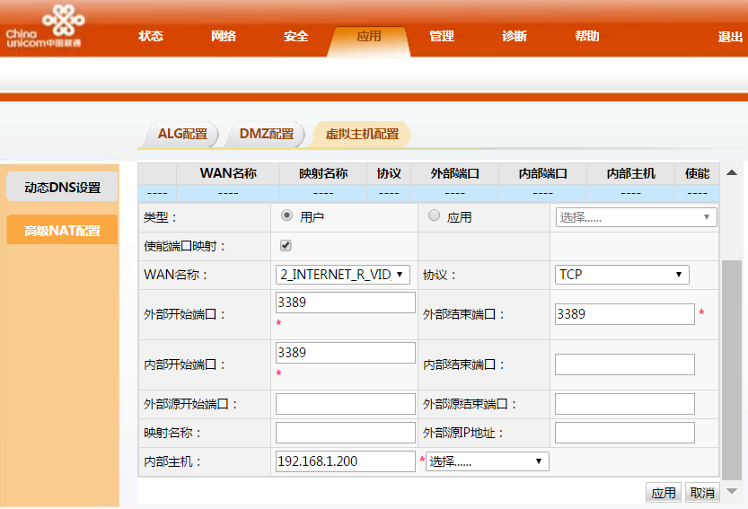
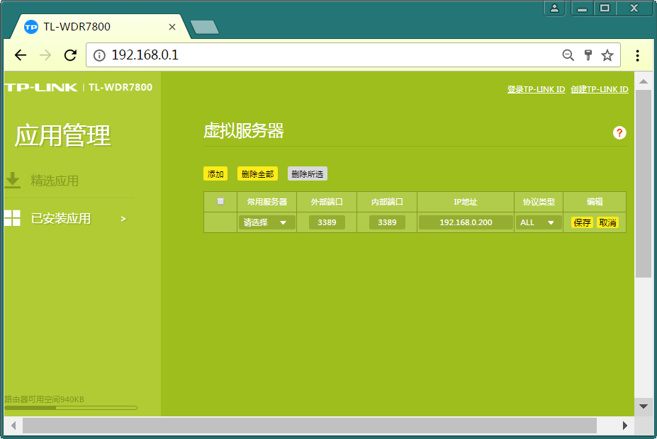
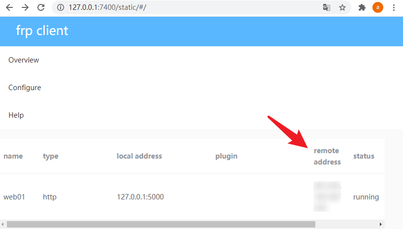

### 提要

当我们从联通获取动态公网IP后，我们想从其他地方来访问内网的服务和远程桌面，那我们该怎么做？

### 学习

[端口映射与HGU DMZ](https://github.com/androllen/KnowlegeRepository/issues/10#issuecomment-680491174)

### 准备

打电话给联通告知宽带账号后，会分配一个动态公网IP

### HGU下接PC的连接方式，从外网远程登录内网的一台PC的远程桌面

HGU（192.168.1.1）——PC（192.168.1.200）

- 电脑直连HGU
- 登录HGU WEB页面 192.168.1.1
- 输入用户名和密码
- 应用 -> 高级NAT配置 -> 虚拟主机配置 -> 新建
- WAN口名称，选择“2_INTERNET_R_VID_3961”，协议选择TCP，外部开始端口填写3389，外部结束端口都填写3389，内部开始端口填写3389、内部主机填写内网这台PC的IP地址，建议这台PC配置静态IP，比如192.168.1.200，然后点击“应用”按钮。
- 
- 我的电脑->右键属性->远程设置->远程桌面->仅允许运行使用网络级别身份验证的远程桌面

    外部端口:外网访问 WAN口IP的端口 <HTTP://WAN口IP:3389>

    内部端口:对应内网服务端口 3389

### HGU下接路由器，路由器再接PC的连接方式，从外网远程登录内网的一台PC的远程桌面

HGU(192.168.1.1) -> 路由器WAN口(192.168.1.200) -> 路由器LAN口(192.168.0.1) -> PC(192.168.0.200)

- HGU 连接 路由器
- 路由器 连接 电脑
- 登录HGU WEB页面 192.168.1.1
- 输入用户名和密码
- 应用 -> 高级NAT配置 -> 虚拟主机配置 -> 新建
- 配置路由器
  - 上网设置

    ```sh
    WAN口连接类型：固定IP地址
    IP地址：192.168.1.200
    子网掩码：255.255.255.0
    网关：192.168.1.1
    首选DNS服务器：192.168.1.1
    然后点击“保存”按钮
    ```

  - LAN口设置  
  如果路由器支持智能识别，以保证路由器和 HGU 的网段（192.168.1.1）不重复，则无需设置，如果不支持则需要手动更改路由器的网段：比如192.168.0.1

      ```sh
      # 每个品牌路由器设置都不同大部分设置都是通过手动改IP
      LAN口IP设置: 手动
      IP地址：192.168.0.1
      子网掩码: 255.255.255.0
      ```

  - 应用管理->已安装应用->虚拟服务器  
  - 来配置路由器的端口映射，外部端口：3389，内部端口：3389，IP 地址：192.168.0.200，协议类型：ALL，然后点击“保存”按钮。  
  

### 使用 Everything 访问内网机器

- 打开 HGU -> 新建虚拟服务配置 -> 设置端口:7900
- 打开内网的 Everything -> Options -> HTTP Server -> Listen on port: 7900 一致
- 在外网下访问你的 公网IP:7900

### 使用 frp 访问内网 Web 服务

- 打开 HGU -> 新建虚拟服务配置 -> 设置端口:7000
- 打开 HGU -> 新建虚拟服务配置 -> 设置端口:7210
- [frp 下载地址](https://github.com/fatedier/frp/releases)
- 在`内网主机`打开 frps.ini

    ```sh
    [common]
    bind_port = 7000
    vhost_http_port = 7210
    token = 20200826164426*-/
    ```

- 在`外网主机`打开 frpc.ini

    ```sh
    [common]
    server_addr = WAN口IP
    server_port = 7000
    token =  20200826164426*-/

    admin_addr = 127.0.0.1
    admin_port = 7400
    admin_user = admin
    admin_pwd = admin


    [web]
    type = http
    local_ip = 127.0.0.1
    local_port = 7210
    custom_domains = WAN口IP
    ```

- 启动 frps 服务器

    ```sh
    frps.exe -c frps.ini
    ```

- 启动 frpc 客户端

    ```sh
    frpc.exe -c frpc.ini
    ```

- `内网主机`Run flask web <http://127.0.0.1:7210/>

    ```python
    from app import Main

    app = Main()

    if __name__ == "__main__":
        app.run(host="0.0.0.0", port=7210)
    ```

- 打开`外网主机`浏览器  [访问 frp 控制台](http://127.0.0.1:7400/)  

      

    访问Web地址 WAN口IP:5000

### 动态公网IP(家庭)访问公司电脑

直接从家庭分配的动态公网IP来访问公司电脑

- 打开 HGU -> 新建虚拟服务配置 -> 设置端口:7000
- 打开 HGU -> 新建虚拟服务配置 -> 设置端口:7210
- 打开 HGU -> 新建虚拟服务配置 -> 设置端口:7211
- [frp 下载地址](https://github.com/fatedier/frp/releases)
- 在`内网主机`打开 frps.ini

    ```sh
    [common]
    bind_port = 7000
    vhost_http_port = 7210
    token = 20200826164426*-/
    ```

- 在`外网主机`打开 frpc.ini

    ```sh
    [common]
    server_addr = WAN口IP
    server_port = 7000
    token =  20200826164426*-/

    admin_addr = 127.0.0.1
    admin_port = 7400
    admin_user = admin
    admin_pwd = admin

    [web]
    type = http
    local_ip = 127.0.0.1
    local_port = 7210
    custom_domains = WAN口IP

    [rdp]
    type = tcp
    local_ip = 0.0.0.0
    local_port = 3389
    remote_port = 7211
    ```

- 启动 frps 服务器

    ```sh
    frps.exe -c frps.ini
    ```

- 启动 frpc 客户端

    ```sh
    frpc.exe -c frpc.ini
    ```

- 公司电脑开启远程设置  
    
    添加用户账号

- 家庭开启远程桌面
    Win+R -> cmd -> mstsc -> WAN口IP:7211 -> 输入用户名和密码

### 更多

[了解 frp](https://www.jianshu.com/p/f934e6f76673)  
