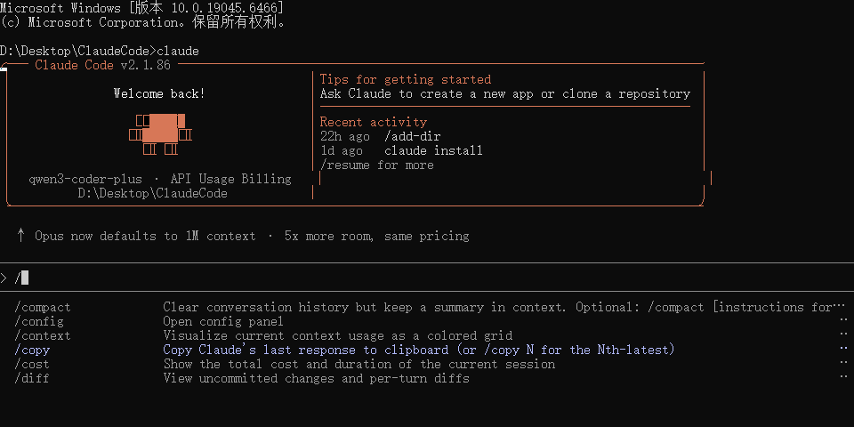
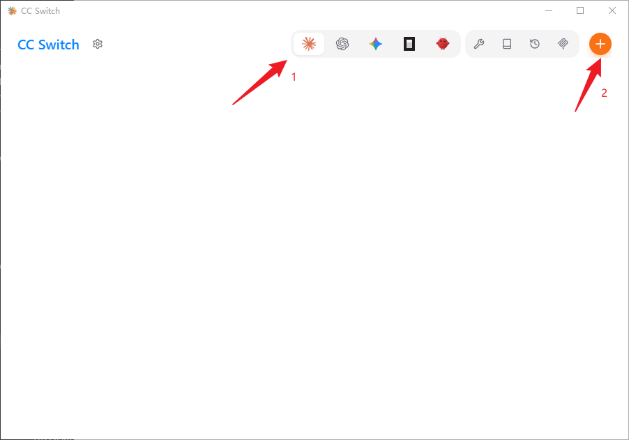
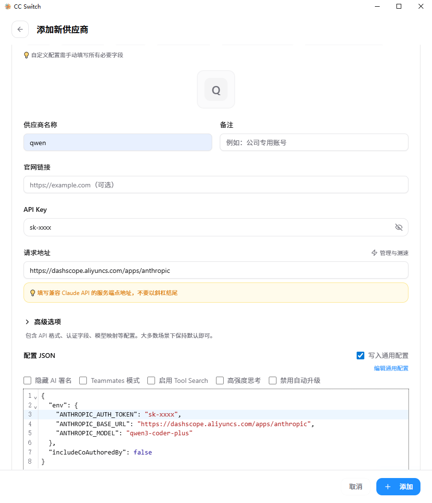
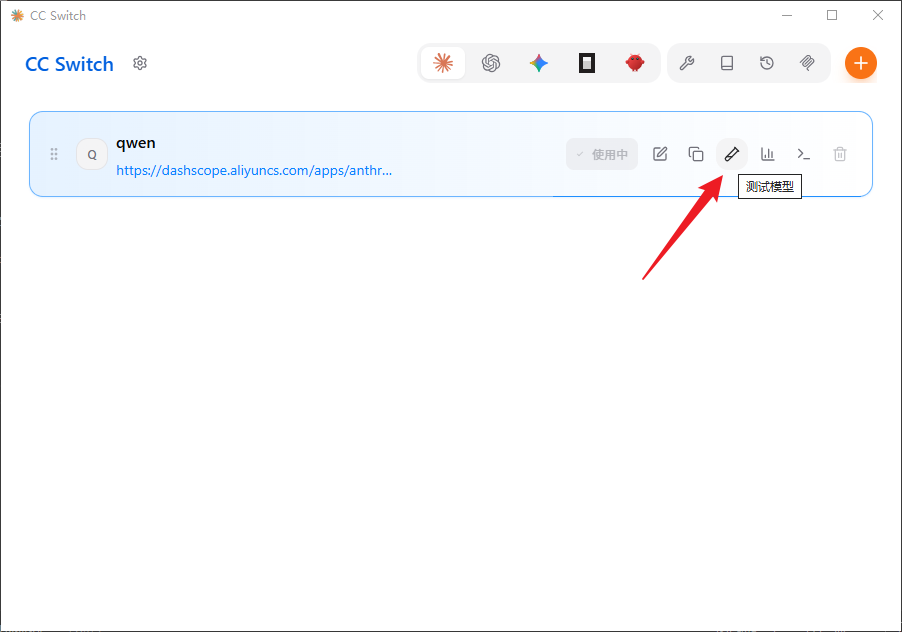
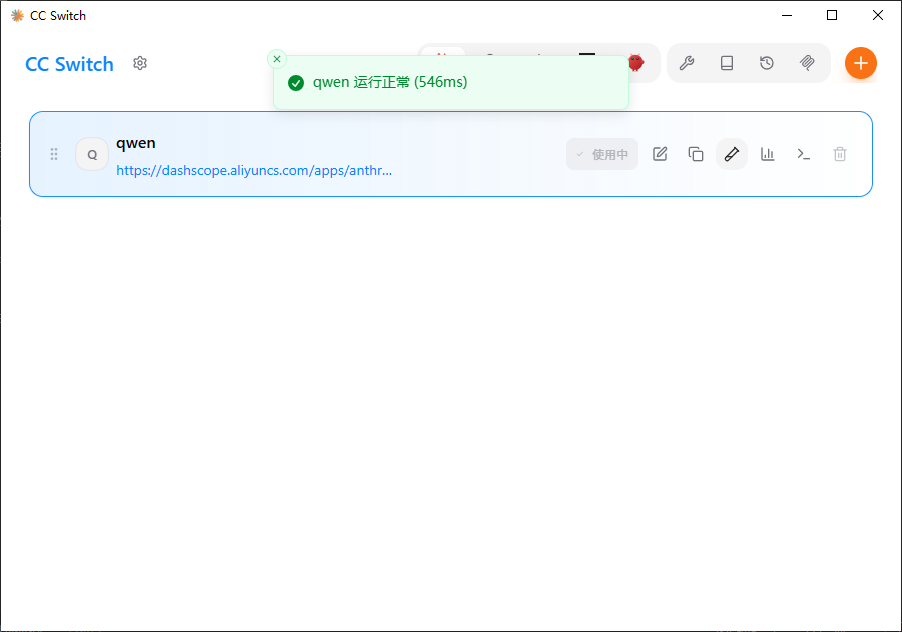
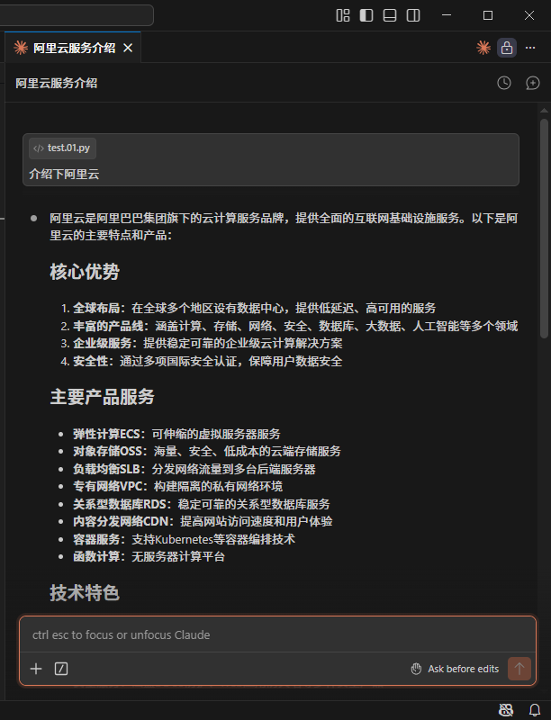

# Claude Code  API 配置 兼容 OPENAI 系



这里只说兼容 OPENAI 系 WSL API配置

我这里使用的是通义千问大模型

## API 配置管理工具 CC Switch

### 说明
这里有很多功能介绍：
https://github.com/farion1231/cc-switch/blob/main/docs/release-notes/v3.12.3-zh.md

### Windows 下载

我使用的是便携版，解压即用，不写入注册表 

https://github.com/farion1231/cc-switch/releases/tag/v3.12.3

[CC-Switch-v3.12.3-Windows-Portable.zip](https://github.com/farion1231/cc-switch/releases/download/v3.12.3/CC-Switch-v3.12.3-Windows-Portable.zip)

sha256:3f1df4e4574ab043f89705fd9a6181e659312e87da171276fd7d7cd6c91f49c6

### Ubuntu or WSL 下载

https://github.com/farion1231/cc-switch/releases/download/v3.12.3/CC-Switch-v3.12.3-Linux-x86_64.deb

sha256:ee0972551b8e895d145cde303fd633b39444f8e8579ad803af9a3e2d6e7c2161

### 配置

Windows 和 Ubuntu or WSL 配置亦如此

- 
- 
- 
- 

## Claude Code

https://github.com/anthropics/claude-code

### 安装 Claude Code for VS Code

我仅在 VSCode for WSL 安装了 Claude Code for VS Code 插件

安装后打开 \\wsl.localhost\Ubuntu\home\androllen\.claude 文件夹

```bash
# 把你刚才配置好的 cc-switch 编辑通用配置 写入到 settings.json
{
  "env": {
    "ANTHROPIC_AUTH_TOKEN": "sk-xxx",
    "ANTHROPIC_BASE_URL": "https://dashscope.aliyuncs.com/apps/anthropic",
    "ANTHROPIC_MODEL": "qwen3-coder-plus"
  },
  "includeCoAuthoredBy": false
}
```

禁用 用户登录

```bash
# 打开VSCode user setting 
"claudeCode.disableLoginPrompt": true,
```

在输入框中输入"介绍阿里云" 如果能正常输出就说明配置成功了~



### 安装 Claude Code 命令行工具

如果想安装Win命令行工具

```bash
winget install Anthropic.ClaudeCode
```

如果想安装WSL命令行工具

```bash
curl -fsSL https://claude.ai/install.sh | bash
```

### 卸载 Claude Code 命令行工具

```sh
# Win
WinGet 安装winget uninstall Anthropic.ClaudeCode
# 别忘记删除配置文件
```

```sh
# WSL
rm -rf ~/.clauderm -f /usr/local/bin/claude
```

