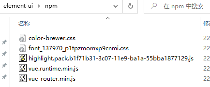
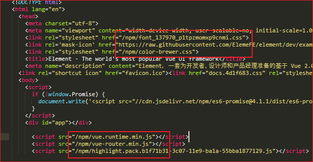

### 下载 

[https://github.com/ElemeFE/element/releases/tag/v2.15.6](https://github.com/ElemeFE/element/releases/tag/v2.15.6)

### 准备

npm install http-server -g

需要提前下载下面五个文件  

  

更改npm文件夹路径下的文件  

  

### 生成

```sh
nvm list
nvm use 14.18.2
npm install
npm run dev
npm run deploy:build
```

### 离线部署

```sh
# cd 到 examples\element-ui 目录下
http-server -p 8080
http://127.0.0.1:8080
```

```sh
install-vuejs-doc.sh
Download and build the Vue.JS documentation for offline access
# Clone the repository
git clone https://github.com/vuejs/vuejs.org.git
cd vuejs.org
# Install the JS dependencies
yarn
# Start the server
yarn start
# The server should now be running on http://localhost:4000/
```

```sh
git clone https://github.com/vuejs/vue-cli.git
cd vue-cli-5.0.8
yarn
npm run docs
# http://localhost:3000/

```

```sh
git clone https://github.com/vuejs/router.git
cd router
yarn
npm run docs:build
# VuePress dev server listening at http://localhost:8080/

```
